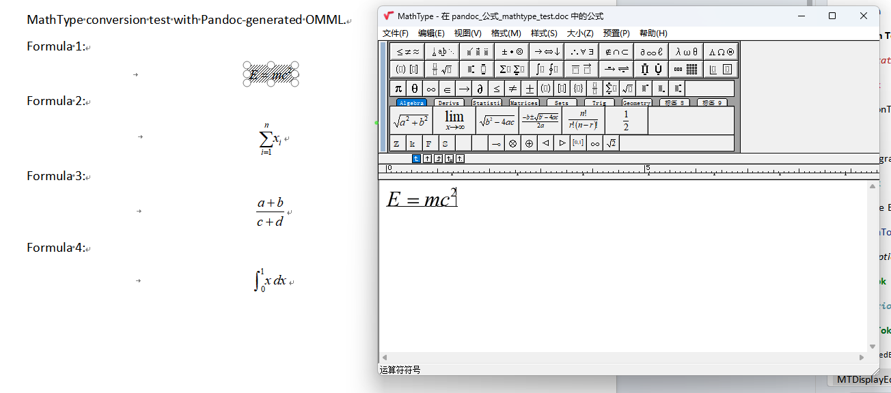

# Codex Formula Conversion

Author: Luo Qiang, Jimei University

Convert bare Markdown variables into Word native equations (OMML), then optionally batch-convert OMML equations into MathType OLE objects.

## What It Does

- Finds bare variables in Markdown, such as `P_sc,k`, `a_k in [0,1]`, `eta_dc`, `alpha`.
- Guides conversion into standard LaTeX.
- Uses Pandoc to generate Word native OMML equations.
- Optionally calls MathType's Word macro to convert all OMML equations into MathType OLE objects.

Default output is Word native OMML. MathType conversion is optional and should only run when explicitly needed.

## Requirements

Core Markdown to Word workflow:

- Pandoc
- Microsoft Word or another `.docx` viewer for checking output

Optional MathType workflow:

- Windows
- Microsoft Word
- MathType installed as Word add-in
- Python 3.9+
- `pywin32`

Install Python dependency:

```powershell
pip install -r requirements.txt
```

## MathType Conversion

Check MathType:

```powershell
python .\scripts\convert_omml_to_mathtype.py --check
```

Convert:

```powershell
python .\scripts\convert_omml_to_mathtype.py "input.docx" "output_mathtype.docx"
```

Success criteria:

```text
Remaining OMML: 0
Output OLE objects: <same as initial OMML count>
Output Equation.DSMT4 markers: <same as initial OMML count>
```

### Fix: "No equations were found and/or updated"

If MathType batch conversion reports "No equations were found and/or updated"
while the document does contain Word native OMML equations, the issue may be
caused by MathType's `OMML2MML.XSL` conversion file.

Reference:
[CSDN troubleshooting note](https://blog.csdn.net/Stranger_No8/article/details/160775351).

Fix:

1. Locate the Microsoft Office installation directory that contains Word's
   `WINWORD.EXE`, for example:
   `C:\Program Files\Microsoft Office\root\Office16`.
2. In that same Office directory, replace `OMML2MML.XSL` with the uploaded
   file: [`assets/OMML2MML.XSL`](assets/OMML2MML.XSL).
3. Open the Word shortcut properties and set **Start in** to the Office
   directory from step 1.
4. Start Word from that shortcut, then run MathType batch conversion again.

The replacement `OMML2MML.XSL` file has been uploaded to this repository and
can be downloaded directly.

## Reference Result

The screenshot below shows Pandoc-generated OMML equations converted into MathType OLE objects and opened in MathType:



## Important Notes

- Do not hand-build low-quality OMML for production. MathType may convert unknown nodes into `?`.
- Recommended route: standard LaTeX -> Pandoc/Word OMML -> MathType conversion.
- For Windows paths with Chinese characters, first copy the file to an ASCII path, then run Python tools.
- Do not commit real papers, generated `.docx` files, `~$*.docx` lock files, or `__pycache__/`.

## License

Apache License 2.0. See [LICENSE](LICENSE).
